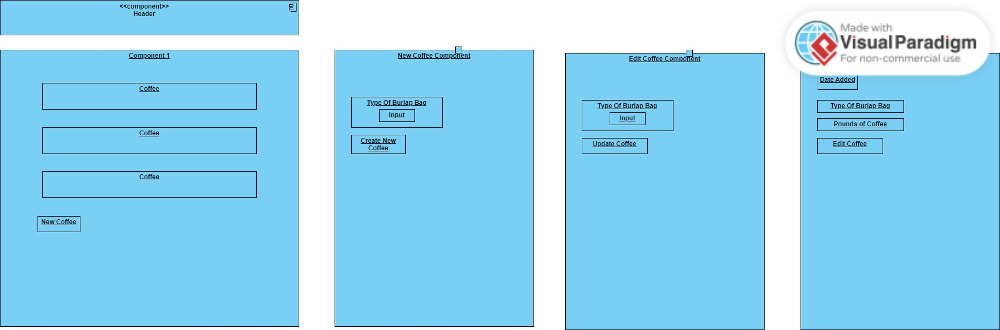

# Coffee-Shop

#### By James Provance

## Technologies Used

* JavaScript
* React
* HTML
* CSS
* JSON
* Node.js

## Description
This is an inventory tracker for a coffee shop. Users are able to add new sacks of beans, which contain 130lbs of coffee, edit or delete a sack of beans and sell a lb of coffee.

## Setup/Installation Requirements

* Clone repository to your desktop
* Navigate to the top level of the directory
* Install all packages with $ npm install.
* Build the project using webpack with $ npm run build
* Start a development server with $ npm run start

## Known Bugs
* No known bugs at this time

## License
MIT

Copyright (c) James Provance

Permission is hereby granted, free of charge, to any person obtaining a copy
of this software and associated documentation files (the "Software"), to deal
in the Software without restriction, including without limitation the rights
to use, copy, modify, merge, publish, distribute, sublicense, and/or sell
copies of the Software, and to permit persons to whom the Software is
furnished to do so, subject to the following conditions:

The above copyright notice and this permission notice shall be included in all
copies or substantial portions of the Software.

THE SOFTWARE IS PROVIDED "AS IS", WITHOUT WARRANTY OF ANY KIND, EXPRESS OR
IMPLIED, INCLUDING BUT NOT LIMITED TO THE WARRANTIES OF MERCHANTABILITY,
FITNESS FOR A PARTICULAR PURPOSE AND NONINFRINGEMENT. IN NO EVENT SHALL THE
AUTHORS OR COPYRIGHT HOLDERS BE LIABLE FOR ANY CLAIM, DAMAGES OR OTHER
LIABILITY, WHETHER IN AN ACTION OF CONTRACT, TORT OR OTHERWISE, ARISING FROM,
OUT OF OR IN CONNECTION WITH THE SOFTWARE OR THE USE OR OTHER DEALINGS IN THE
SOFTWARE.

